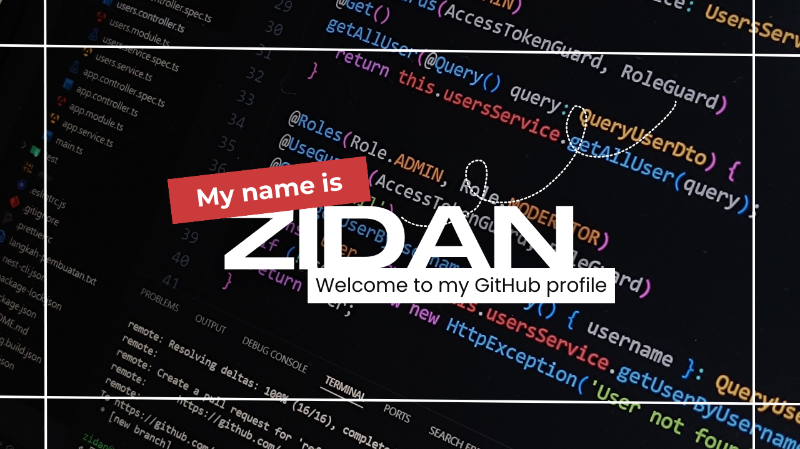

<h1 align="center">Hi 👋, I'm Zidan Indratama</h1>
<h3 align="center">I'm a full-stack web developer. My standout quality lies in my unwavering passion for crafting seamless UI/UX designs, a skill that sets me apart in the industry.</h3>

 
 
 
  

 

## About Me

- 🔭 I’m currently working on [Brevet](https://tax-center-brevet-gunadarma.vercel.app/)
- 🌱 I’m currently learning **NextJS, NestJS, Go and Docker**
- 👯 I’m looking to collaborate on [Predictive Lead Scoring](https://github.com/zidanindratama/fe-predictive-lead-scoring)
- 👨‍💻 All of my projects are available at [https://zidanindratama.vercel.app/](https://zidanindratama.vercel.app/)
- 💬 Ask me about **ReactJS, NextJS, and NestJS**
- 📫 How to reach me **zidanindratama03@gmail.com**
- ⚡ Fun fact **I really really love being a Fullstack App Developer**

## Languages & Tools

### Front-End (Web)

### Mobile (React Native / Expo)

### Back-End

### Database

### DevOps & Testing

---

<h3 align="left">GitHub Stats:</h3>

 

